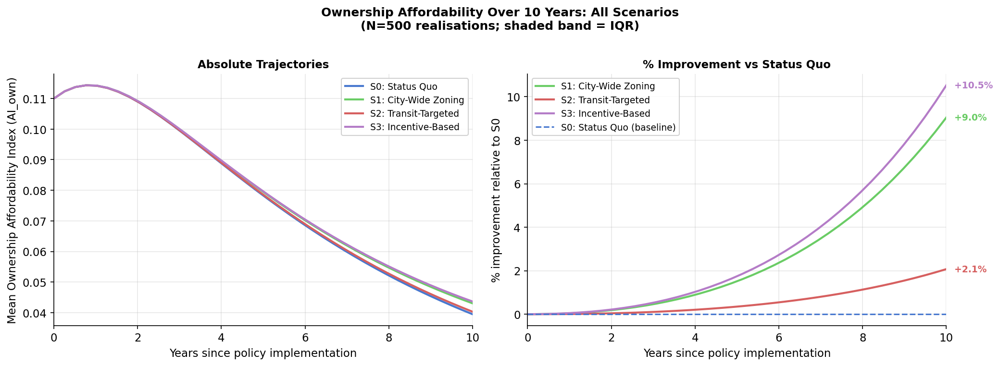

# Missing-Middle Zoning in Toronto: An Agent-Based Model of Housing Affordability

A census-tract-resolution agent-based simulation quantifying how alternative missing-middle zoning policies change housing affordability across Toronto over a 10-year horizon, under infrastructure constraints and uncertain market response.

**Course:** SYDE 535 — Computational Simulations for Socio-Economic Systems
**Team:** Devon Kisob, Chanuth Weeraratna, Kevin Kim

---

## Research Question

For the City of Toronto, how do alternative missing-middle zoning implementations change the evolution of housing affordability across 1,220 census tracts (CTs) over a 10-year horizon, under infrastructure capacity constraints and uncertain market response?

## Headline Findings

Across N=500 Monte Carlo realisations (T=40 quarterly steps, seed=42):

| Scenario | Final AI<sub>own</sub> | Δ vs S0 | Units added/yr | Eligible CTs |
|---|---:|---:|---:|---:|
| **S0**: Status quo | 0.0395 | — | 0 | 0 |
| **S1**: City-wide zoning | 0.0430 | **+8.9 %** | 5,586 | 1,220 |
| **S2**: Transit-targeted | 0.0403 | +2.0 % | 1,916 | 181 |
| **S3**: Incentive-based reform | 0.0436 | **+10.4 %** | 6,414 | 1,220 |

> AI<sub>own</sub> = median household income / home price. Higher = more affordable. Baseline at t=0 ≈ 0.110; all scenarios decline under the simulated demand trajectory, but the zoning reforms meaningfully slow the rate of decline.

**Counter-intuitive result — the transit-targeting paradox.** Transit-targeted zoning (S2), despite being the most spatially efficient policy, captures only ~22 % of the affordability benefit of city-wide zoning (S1). The transit-weighted demand allocation already directs development toward high-accessibility CTs *without* an explicit eligibility restriction; constraining eligibility to the 181 transit-adjacent CTs forecloses supply response elsewhere without proportionate gain.



---

## Methodology

### Agents and Environment
- **1,220 Census Tract agents** (`CensusTractAgent`) initialised from Statistics Canada 2021 Census of Population data, with each CT carrying: median household income, median home price, median rent, dwelling stock, vacancy rate, infrastructure capacity, and rapid-transit proximity (TTC GTFS, 500 m buffer).
- **Four pseudo-agents** govern system dynamics each quarter:
  1. `DemandAllocationModel` — distributes city-wide demand across CTs weighted by inverse home price and transit proximity.
  2. `PolicyModel` — encodes scenario-specific eligibility (S0–S3) and incentive levels.
  3. **Two-stage development model** — (i) logistic regression predicts development occurrence (CV F1 = 0.747); (ii) random forest predicts development magnitude (CV R² = 0.534). Trained on inter-censal 2016 → 2021 dwelling stock change with 5-fold CV.
  4. `update_market` — price/rent elasticity update based on vacancy gap relative to equilibrium.

### Calibration
Price elasticity (κ<sub>p</sub> = 2.149) and rent elasticity (κ<sub>r</sub> = 1.446) were calibrated by grid search against Teranet-National Bank HPI and CMHC rent data for Toronto CMA over 2010–2019, targeting empirical 6 %/yr and 4 %/yr trends respectively. Steady-state vacancy v<sub>eq</sub> = 0.013 and target vacancy v* = 0.030 derived from CMHC GTA averages.

A **price floor of 30 % of the 2021 census value** was imposed in `update_market` to prevent a rare vacancy-feedback divergence in supply-heavy scenarios (1 in 500 realisations affected pre-fix); see `src/agents.py`.

### Sensitivity Analysis
One-factor-at-a-time (OFAT) sensitivity on 7 epistemically uncertain parameters (κ<sub>p</sub>, κ<sub>r</sub>, ω<sub>0</sub>, ω<sub>1</sub>, base demand, demand growth, v<sub>eq</sub>) at ±20 %, run on both S0 (no development) and S1 (city-wide). Price elasticity and steady-state vacancy dominate; rent elasticity has no effect on AI<sub>own</sub> by construction (separate affordability channel). Infrastructure parameters show near-zero influence under current Toronto density levels, an identified model limitation. See `scripts/sensitivity_analysis.py` and tornado charts in `results/figures/`.

### Limitations
- Stage 2 random forest has unexplained variance (CV R² = 0.534) in development magnitude — high-rise outlier CTs dominate the upper tail.
- Median household income is held static over the 10-year horizon.
- Infrastructure strain feedback is implemented but rarely activates at current density levels.
- 128 CTs were excluded from calibration due to 2016 → 2021 boundary changes; 8 (home price) and 11 (rent) suppressed-value CTs were imputed via KNN on income/dwelling-stock/transit features.

---

## Project Structure

```
ABM-Zoning-Toronto/
├── src/
│   ├── agents.py            # CensusTractAgent, PolicyModel, DemandAllocationModel
│   ├── calibration.py       # Two-stage ML development model (logistic + RF)
│   ├── simulation.py        # Monte Carlo orchestrator
│   ├── visualization.py     # Trajectory, boxplot, heatmap, tornado plotting
│   ├── config.py            # Global simulation parameters
│   └── paths.py             # Filesystem path constants
├── scripts/
│   ├── preprocess_census.py         # StatCan 2016 + 2021 census preprocessing
│   ├── compute_transit_indicator.py # TTC GTFS rapid-transit proximity per CT
│   ├── knn_impute.py                # KNN imputation for suppressed CT values
│   ├── calibrate_elasticity.py      # Grid-search calibration vs Teranet/CMHC
│   ├── run_simulation.py            # CLI runner (--fast / --full / per-scenario)
│   ├── sensitivity_analysis.py      # OFAT sensitivity with tornado output
│   └── make_spatial_heatmap.py      # CT-level choropleth (S1/S2 vs S0)
├── notebooks/
│   ├── final_results.ipynb          # Final report results, figures, sensitivity
│   └── milestone2_results.ipynb     # M2 baseline (historical reference)
├── data/
│   ├── raw/                         # StatCan + TTC GTFS (not in git)
│   ├── interim/                     # Intermediate files (not in git)
│   └── processed/                   # CT agents, calibration outputs, N=500 results
├── results/
│   └── figures/                     # Publication figures (trajectories, heatmaps, tornados)
└── docs/
    ├── SYDE 535 - Project Pitch.pdf
    ├── SYDE 535 Milestone 1.pdf
    ├── SYDE 535 Milestone 2.pdf
    └── SYDE 535 Final Report.pdf
```

---

## Reproducibility

### Environment
```bash
python -m venv .venv
source .venv/bin/activate
pip install -r requirements.txt
```

### Data
StatCan 2016 and 2021 Census of Population data and TTC GTFS feed are not redistributed in this repo (~4 GB combined). See [`data/README.md`](data/README.md) for download instructions and place under `data/raw/`.

### Pipeline
```bash
# 1. Preprocess raw data (one-time, ~5 min)
python scripts/preprocess_census.py
python scripts/compute_transit_indicator.py
python scripts/knn_impute.py

# 2. Calibrate ML development model (~1 min)
python -c "from src.calibration import train_models; train_models()"

# 3. Calibrate market elasticity (~2 min)
python scripts/calibrate_elasticity.py

# 4. Run simulation
python scripts/run_simulation.py --fast    # N=10  (~1 min, smoke test)
python scripts/run_simulation.py           # N=100 (~15 min)
python scripts/run_simulation.py --full    # N=500 (~80 min, final-report config)

# 5. Sensitivity analysis (per-scenario, ~40 min each)
python scripts/sensitivity_analysis.py --scenario S0
python scripts/sensitivity_analysis.py --scenario S1
```

### Results
Open [`notebooks/final_results.ipynb`](notebooks/final_results.ipynb) — the notebook is pre-run with all N=500 figures embedded inline and loads cached `.npy` results, so no re-simulation is required to view findings.

---

## Key Tooling
NumPy · pandas · scikit-learn (RandomForestRegressor, LogisticRegression) · GeoPandas · Matplotlib · TTC GTFS · Statistics Canada Census 2016/2021 · Teranet–National Bank HPI · CMHC Rental Market Survey
